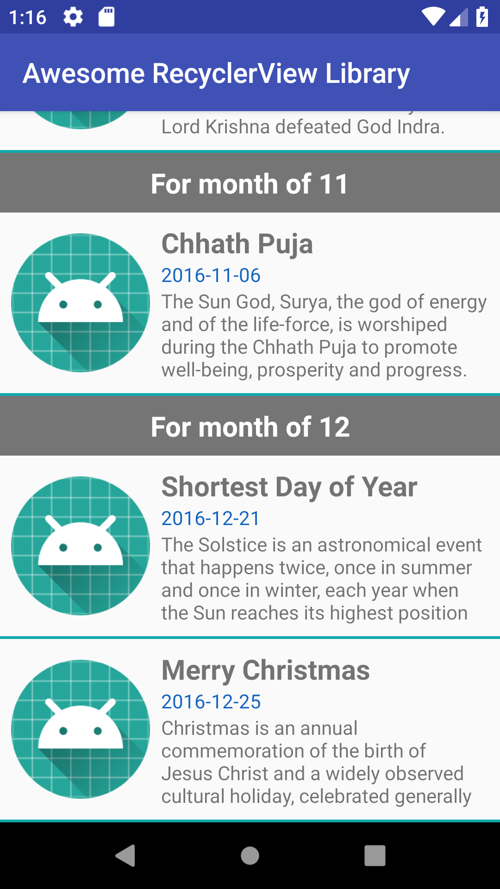

# Awesome RecyclerView Library for Super Easy Implementation of Simple and MultiView Layout

*An awesome library for the Android to make Simple RecyclerView and Multi Layout Recyclerview*

Add the following line in dependencies part of  ```build.gradle``` in app directory.

```
implementation 'com.hereshem.lib:awesomelib:2.1.1'

```


## Simple RecyclerView Implementation

**Add RecyclerView in the layout file using the following**

```
<com.hereshem.lib.recycler.MyRecyclerView
        android:id="@+id/recycler"
        app:layoutManager="LinearLayoutManager"
        android:layout_width="match_parent"
        android:layout_height="match_parent"/>
```

**Create View Holders with very easy code**. Provide the type of class that support the holder to display with. That class will be binded to display the content.

```
public static class EVHolder extends MyViewHolder<Events> {
    TextView date, title, summary;
    public EVHolder(View v) {
        super(v);
        date = v.findViewById(R.id.date);
        title = v.findViewById(R.id.title);
        summary = v.findViewById(R.id.summary);
    }
    @Override
    public void bindView(Events c) {
        date.setText(c.date);
        title.setText(c.title);
        summary.setText(c.summary);
    }
}
```
**Create Items List variable and adapters with very few lines**

```
List<Events> items = new ArrayList<>();
MyRecyclerView recycler = findViewById(R.id.recycler);
RecyclerViewAdapter adapter = new RecyclerViewAdapter(this, items, EVHolder.class, R.layout.row_event);
recycler.setAdapter(adapter);
```

**Add ClickListener and LoadMore**

```
recycler.setOnItemClickListener(new MyRecyclerView.OnItemClickListener() {
    @Override
    public void onItemClick(int position) {
        Toast.makeText(MainActivity.this, "Recycler Item Clicked " + position, Toast.LENGTH_SHORT).show();
    }
});

recycler.setOnLoadMoreListener(new MyRecyclerView.OnLoadMoreListener() {
    @Override
    public void onLoadMore() {
        loadData();
    }
});
loadData();
```

**That's it**.

-----------
## Multi Layout RecyclerView 

Create More View Holders

```
public static class TVHolder extends MyViewHolder<String> {
    TextView title;
    public TVHolder(View v) {
        super(v);
        title = v.findViewById(R.id.title);
    }
    @Override
    public void bindView(String c) {
        title.setText(c);
    }
}

public static class DVHolder extends MyViewHolder<Integer> {
    TextView title;
    public DVHolder(View v) {
        super(v);
    }
    @Override
    public void bindView(Integer c) {
    }
}
```

Define Multiview with **MultiLayoutHolder** where the multiple layout is binded to play with the class initialized for the specific ViewHolder with specific layout.

```
List<MultiLayoutHolder> holders = new ArrayList<>();
holders.add(new MultiLayoutHolder(Events.class, EVHolder.class, R.layout.row_event));
holders.add(new MultiLayoutHolder(String.class, TVHolder.class, R.layout.row_simple));
holders.add(new MultiLayoutHolder(Integer.class, DVHolder.class, R.layout.row_divider));

```


**Now Initialize Adapter with very simple code**

```
List<Object> items = new ArrayList<>();
MultiLayoutAdapter adapter = new MultiLayoutAdapter(this, items, holders);
recycler.setAdapter(adapter);
```

The MultiLayout is automatically selected with the type of data added to the items. 

```items.add(new Events(...));``` binds the EVHolder and Events item is displayed into the RecyclerView.

```items.add(new String("Hem Shrestha"));``` binds the TVHolder and String item is displayed.

```items.add(new Integer(1));``` binds and displays the divider layout.


----

## Bonus

Online Data request to server made more simpler using the following code.

```
private void loadData() {
    new MyDataQuery(this) {
        @Override
        public void onSuccess(String identifier, String result) {
            List<Events> data = Events.parseJSON(result);
            if (table_name.equals("0")) {
                items.clear();
            }
            if (data.size() > 0) {
                String last="";
                for (int i = 0; i < data.size(); i++) {
                    items.add(new Integer(1)); 					// adding Divider data
                    if (!last.equals(data.get(i).date.substring(5,7))) {
                        last = data.get(i).date.substring(5,7);
                        items.add("For month of " + last); 			// adding String data
                    }
                    items.add(data.get(i)); 					// adding Event data
                }
                recycler.loadComplete();
                start += data.size();
            } else {
                recycler.hideLoadMore();
            }
        }
    }
    .setUrl("http://dl.mantraideas.com/apis/events.json")
    .setMethod(Method.GET)
    .setIdentifier(start+"")
    .execute();
}
```

**Further more** - Offline support can also be provided.

```
new MyDataQuery(this) {
	...
	...
    @Override
    public String onDataQuery(String identifier) {
        if(identifier.equals("0")){
            return new Preferences(getApplicationContext()).getPreferences("data_downloaded");
        }
        return super.onDataQuery(identifier);
    }

    @Override
    public void onDataSave(String identifier, String response) {
        if(identifier.equals("0")){
            new Preferences(getApplicationContext()).setPreferences("data_downloaded", response);
        }
    }
    ...
    ...
}...
```

In case of using **Proguard**, use these lines

```
-keep class com.hereshem.lib.** {*;}
-dontwarn com.hereshem.lib.**
```

*Happy Coding :)*